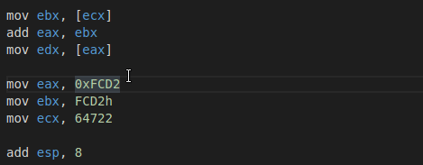
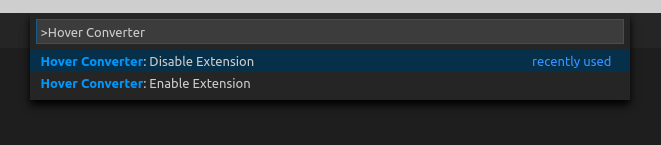

# Hover Converter

 A simple Visual Studio Code Extension which allows you to convert Hex and Decimal values to their corresponding Binary, Hex or Decimal values by just hovering over them.

## Usage
--------

### Just hover over your values

-------
### To enable/disable the extension open the command palette (F1 or CTRL+SHIFT+P) and enter the following commands

* `Hover Converter: Enable Extension`
* `Hover Converter: Disable Extension`

-------

### The following formats are currently supported 

* `Hex : 0xFF`
* `Hex : FFh`
* `Decimal : 12345`
-----------
## Release Notes

### 0.0.1

Initial release of Hover Converter

#### Credits
Icons taken from [Freepik](https://www.flaticon.com/authors/freepik)
